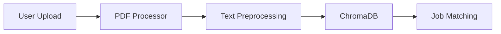

# Documentation Directory

This directory contains project documentation, guides, and reference materials for the Hirely application.

## Contents

### `CLEANUP_SUMMARY.md`
**Purpose:** Documents the codebase reorganization completed on December 2, 2025

**Contents:**
- File organization changes
- Directory structure improvements
- Documentation additions
- Git commit message template

**Date:** December 2, 2025

---

## Future Documentation (Recommended)

### Architecture Documentation
- **`ARCHITECTURE.md`** - System architecture and design decisions
- **`DATABASE_SCHEMA.md`** - Complete database schema documentation
- **`API_REFERENCE.md`** - API endpoints and usage examples

### User Guides
- **`USER_GUIDE.md`** - Guide for job seekers
- **`ADMIN_GUIDE.md`** - Guide for employers/admins
- **`DEPLOYMENT_GUIDE.md`** - Production deployment instructions

### Developer Documentation
- **`CONTRIBUTING.md`** - Guidelines for contributors
- **`CODING_STANDARDS.md`** - Code style and best practices
- **`TESTING_GUIDE.md`** - How to write and run tests

### Technical Specifications
- **`MATCHING_ALGORITHM.md`** - Detailed explanation of BM25 + Cosine similarity
- **`PREPROCESSING_PIPELINE.md`** - Text preprocessing documentation
- **`SECURITY_IMPLEMENTATION.md`** - Security measures and protocols

---

## Documentation Best Practices

### Writing Documentation

✅ **DO:**
- Use clear, concise language
- Include code examples where relevant
- Keep documentation up-to-date with code changes
- Use proper Markdown formatting
- Add diagrams for complex concepts
- Include troubleshooting sections

❌ **DON'T:**
- Assume prior knowledge
- Skip error handling examples
- Use jargon without explanation
- Let documentation become outdated
- Forget to version documentation

### Markdown Guidelines

```markdown
# Main Title (H1)

## Section (H2)

### Subsection (H3)

**Bold** for emphasis
*Italic* for emphasis
`code` for inline code

```python
# Code blocks with syntax highlighting
def example():
    pass
```

- Bullet lists
1. Numbered lists

[Link text](URL)
```

---

## Maintenance

### Regular Reviews
- **Monthly:** Review and update as features are added
- **Release:** Update before each major release
- **Bug Fixes:** Document known issues and solutions

### Version Control
- Commit documentation changes with code changes
- Use meaningful commit messages
- Tag documentation versions with releases

---

## Contributing

To add new documentation:

1. Create markdown file in this directory
2. Follow naming convention: `UPPERCASE_WITH_UNDERSCORES.md`
3. Update this README with a link
4. Include date and author information
5. Submit for review

---

## Documentation Tools

### Recommended Tools
- **MkDocs** - Static site generator for documentation
- **Sphinx** - Python documentation generator
- **Read the Docs** - Documentation hosting
- **Mermaid** - Diagram generation in markdown

### Example: Mermaid Diagrams



---

## Quick Links

### Internal Documentation
- [App Structure](../app/README.md)
- [Scripts Documentation](../scripts/README.md)
- [Tests Documentation](../tests/README.md)
- [Utils Documentation](../app/utils/README.md)

### External Resources
- [Flask Documentation](https://flask.palletsprojects.com/)
- [ChromaDB Documentation](https://docs.trychroma.com/)
- [SQLAlchemy Documentation](https://docs.sqlalchemy.org/)

---

## Contact

For documentation questions or suggestions:
- Open an issue on GitHub
- Contact the development team
- Submit a pull request with improvements

---

**Last Updated:** December 2, 2025
**Maintainer:** Development Team
